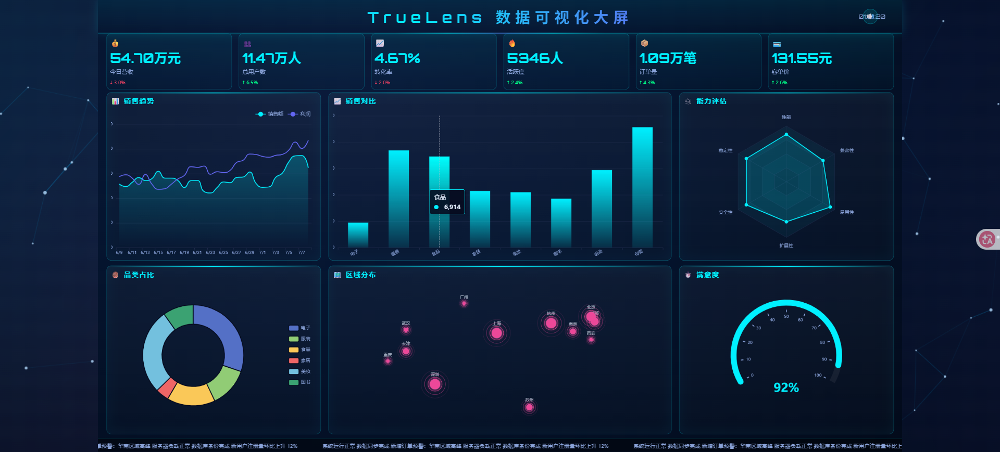

# TrueLens 数据大屏构建指令

## 1. 任务目标

请使用 **Vanilla TypeScript + Vite 6 + ECharts 5** 技术栈，从零创建一个可直接运行的数据可视化大屏项目，最后自动在默认浏览器中打开大屏预览页面。




## 2. 技术约束（必须严格遵循）

- **禁止使用 React、Vue、Angular 等框架**，纯原生 TS + DOM 操作
- 必须使用 **TypeScript**，所有代码必须有类型标注
- **构建工具**：Vite 6，必须能正常 `npm install`、`npm run dev`、`npm run build`
- **可视化库**：Apache ECharts 5，通过 npm 安装
- **样式**：Tailwind CSS（通过 CDN 引入，或 vite-plugin-css-injected-by-js 单独打包均允许；优先使用 CDN 以降低复杂度）
- **HTTP 请求**：封装统一的 `Fetcher` 类，请求拦截器内部根据环境变量路由到 Mock 数据或真实 API，保证开发阶段数据丰富、展示效果好
- **状态管理**：自研轻量 Store（基于观察者模式 + EventTarget），必须模块化，分文件管理
- **路由**：自制 Hash Router（基于 `hashchange` 事件），仅作展示用
- **日志系统**：自研 `Logger` 类，支持 `debug / info / warn / error` 四级，带模块标签，输出格式化为带时间戳的彩色文本，写入 localStorage offset 持久化最近 100 条

## 3. 工程化要求（必须全部实现）

### 3.1 模块化目录结构（禁止所有代码写在一个文件）

```
src/
├── main.ts                 # 入口，初始化所有模块并启动应用
├── router/
│   ├── index.ts            # Router 主类，解析 hash，分发页面
│   └── routes.ts           # 路由表定义
├── store/
│   ├── index.ts            # Store 主入口
│   └── modules/
│       ├── dashboard.ts    # 大屏主页状态（当前时间、刷新间隔、全局主题等）
│       └── chartData.ts    # 图表数据状态（各模块数据缓存与过期控制）
├── services/
│   ├── fetcher.ts          # Fetcher 类：封装 fetch + 拦截器 + Mock/API 切换
│   └── mock.ts             # 丰富的 Mock 数据生成工厂（时间序列、随机漫步、分类占比等）
├── components/
│   ├── base/
│   │   └── Loading.ts      # 通用加载组件
│   └── charts/
│       ├── LineChart.ts    # ECharts 折线图封装
│       ├── BarChart.ts     # ECharts 柱状图封装
│       ├── PieChart.ts     # ECharts 饼图封装
│       ├── RadarChart.ts   # ECharts 雷达图封装
│       ├── GaugeChart.ts   # ECharts 仪表盘封装
│       └── MapChart.ts     # ECharts 地图或散点气泡封装
├── pages/
│   └── dashboard/
│       ├── index.ts        # 大屏页面入口：初始化布局、创建图表实例、绑定数据
│       ├── layout.ts       # 大屏布局配置（Grid/Flex 分配各区块位置与大小）
│       └── themes.ts       # 大屏主题色板配置
├── utils/
│   ├── logger.ts           # Logger 类：分级、模块标签、格式化输出、localStorage 持久化
│   ├── formatter.ts        # 数字格式化、百分比、科学计数等
│   ├── date.ts             # 时间格式化工具
│   └── dom.ts              # DOM 查询/创建/尺寸工具函数
├── styles/
│   └── main.css            # 全局样式、动画、背景、大屏适配
└── types/
    ├── chart.ts            # Chart 配置相关类型
    ├── mock.ts             # Mock 数据类型
    └── global.d.ts         # 全局类型声明
```

### 3.2 Mock 数据要求

- `mock.ts` 必须生成大屏展示所需 6~8 个模块的完整数据
- 数据模块至少包含：
  1. 核心指标卡（KPI 卡片 4-6 个，如营收/用户量/转化率/活跃度）
  2. 趋势折线图（近 30 日数据时序）
  3. 柱状对比图（季度/部门/地区多维度对比）
  4. 饼图/环形图（占比分布，支持 drill-down 视角）
  5. 雷达图（多维度能力评估）
  6. 仪表盘（实时完成率/满意度等）
  7. 实时数据流（自动滚动更新的最近 N 条记录表格或列表）
   8. 地图散点或气泡图（区域分布，使用 ECharts 自带中国地图 GeoJSON 注册）

### 3.3 大屏视觉要求

- **背景**：使用深色科技风渐变背景（深蓝到黑），带网格线纹理或粒子光效
- **主题色**：主色调用青色 `#00f0ff` / 蓝紫 `#6366f1` / 品红 `#ec4899` 等
- **标题栏**：顶部悬浮标题，带发光边框和装饰性元素
- **布局**：采用 CSS Grid 或绝对定位 + Flex 组合，将大屏划分为多个区域（header 顶部、footer 底部、中间左/中/右 columns）
- **动画**：
  - 页面加载时数字递增动画（Counter 动画）
  - 图表渐入动画（fade + slide up）
  - 边框流光动画（border gradient animation）
  - 背景粒子/光点缓慢浮动
- **字体**：使用 `Orbitron`（科技数字字体）或系统中文字体回退；数字使用等宽定位
- **响应式/缩放**：大屏必须使用 `transform: scale()` 方案，兼容 1920x1080 分辨率，允许通过浏览器缩放适配其他屏幕
- **滚动字幕**：底部或侧边增加实时滚动通知条

### 3.4 日志系统

- `utils/logger.ts` 必须实现完整功能：
  - 构造函数传入 `module: string` 作为模块标签
  - `debug(msg)`, `info(msg)`, `warn(msg)`, `error(msg)` 四个方法
  - 带时间戳（HH:mm:ss.SSS）和模块标签的格式化输出
  - 输出包含颜色区分（debug 灰、info 白、warn 黄、error 红）
  - 未超过 `localStorage` 上限（最新 100 条）时追加写入，自动去重关键日志
  - 提供 `logger.getHistory()` 静态方法读取历史日志
  - 在开发环境默认启用 `debug`，生产环境默认 `info`

### 3.5 测试系统

- 使用 **Vitest**，安装依赖后在项目根目录创建 `tests/` 目录
- 必须包含以下测试文件：
  - `tests/utils/logger.test.ts` — 测试 Logger 各级别输出与 localStorage 写入
  - `tests/services/fetcher.test.ts` — 测试 Fetcher 的网络请求拦截逻辑、Mock 数据返回
  - `tests/utils/formatter.test.ts` — 测试数字格式化函数
  - `tests/store/chartData.test.ts` — 测试 Store 的数据读写与观察者通知
- `package.json` 中 script 必须包含 `"test": "vitest run"` 和 `"test:watch": "vitest"`，且测试必须能全部通过

## 4. package.json 要求

- `name` 设置为 `truelens-dashboard`
- `version` 设置为 `0.1.0`
- `type: "module"` 启用 ESM
- **scripts 必须包含**：`dev`、`build`、`preview`、`test`
- **dependencies**：`echarts`、`event-target-polyfill`（如需）
- **devDependencies**：`typescript`、`vite`、`vitest`、`@types/node`
- 必须包含 `engines` 字段约束 Node.js 版本：`>= 18.0.0`

## 5. 配置要求

- `tsconfig.json`：
  - `target: ES2020`
  - `module: ESNext`
  - `moduleResolution: bundler`
  - `strict: true`
  - `noUnusedLocals: true`
  - `noUnusedParameters: true`
  - `sourceMap: true`
- `vite.config.ts`：
  - base 配置为 `/`
  - server port 默认为 `3000`，打开浏览器
  - build outDir 为 `dist`，rollupOptions 资源目录为 `assets`
  - 必须配合 vitest 配置（`test` 字段）

## 6. 执行要求

1. 务必在项目根目录 `E:\TrueLens\` 下操作
2. 按照上述目录结构精确创建所有文件
3. 确保所有 TypeScript 代码通过 `tsc --noEmit` 类型检查（如果无法运行 tsc，至少保证 vite 能正常 build）
4. 确保所有测试通过
5. 开发服务器启动后，**自动在默认浏览器中打开 `http://localhost:3000`**
6. 页面视觉效果必须达到"漂亮"的科技感大屏标准：深色背景、发光效果、流光边框、图表丰富、布局协调
7. Mock 数据必须丰富且逼真，展示 8 个以上数据模块
8. 数据必须每 3-5 秒自动刷新（使用 `setInterval` + Fetcher 模拟），带来实时感

## 7. 验收标准（AI 自我检查清单）

- [ ] `npm install && npm run dev` 能正常启动，端口 3000，无控制台报错
- [ ] 浏览器自动打开，看到完整大屏页面
- [ ] 顶部标题栏美观，居中且带装饰
- [ ] 至少 6 个 ECharts 图表正常渲染（折线、柱状、饼图、雷达、仪表盘、地图/气泡）
- [ ] 4-6 个 KPI 数字卡片，带 Counter 动画
- [ ] 底部有实时滚动通知条
- [ ] 数据每 3-5 秒自动刷新
- [ ] 6-8 模块的 Mock 数据丰富、逼真
- [ ] 所有代码按模块化目录组织，无单文件堆砌
- [ ] `npm run build` 能正常打包输出到 `dist/`
- [ ] `npm run test` 所有测试通过
- [ ] Logger 功能正常，模块标签正确，输出带颜色和时间戳
- [ ] Fetcher 请求到 `/api/*` 路径时，自动转到内部 Mock 工厂生成数据

